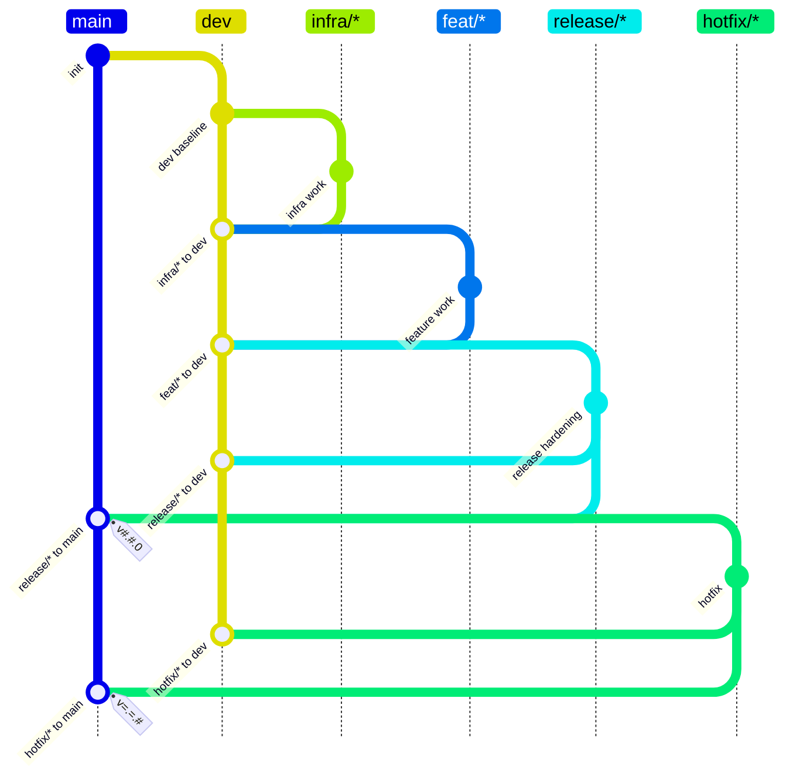

# Git Flow Policy Writer

## Purpose

Write `CONTRIBUTING.md` branch workflow docs where the Mermaid `gitGraph` is a restricted policy DSL, not just an illustration. The graph should be readable by humans and parseable into rules for `reference-transaction` hooks.

## DSL Rules

- Use one Mermaid fenced block with `gitGraph TB:`.
- Treat `main` and `dev` as literal long-lived branches.
- Represent branch families directly as quoted wildcard branches:
  - `"infra/*"`
  - `"feat/*"`
  - `"release/*"`
  - `"hotfix/*"`
- Do not use concrete examples such as `infra/sensor-driver` when the policy means all `infra/*`.
- Always quote wildcard branch names in gitGraph statements: `branch "infra/*"`, `checkout "infra/*"`, `merge "infra/*"`.
- Interpret `branch X` after `checkout Y` as `Y` may branch to `X`.
- Interpret `checkout TARGET` followed by `merge "SOURCE"` as `SOURCE` must be allowed to merge into `TARGET`.
- Write merge ids in exact machine-friendly form without angle brackets: `id:"SOURCE to TARGET"`, for example `id:"release/* to main"`.
- Do not encode special semantics in labels such as `back-merge`. If a source family must land in multiple targets, express that by merging it into each target in the graph and describe it as a required merge in prose.
- If a source family merges into more than one target, treat those targets as required containment targets for the same source family.
- Put release/hotfix tag symbols directly on the `main` merge statement.
- Use tag patterns directly in `tag:"..."` so the graph remains the source of truth:
  - release main merge: `tag:"v#.#.0"`
  - hotfix main merge: `tag:"v=.=.#"`
- Interpret `#` in tag patterns as one or more decimal digits.
- Interpret `=` in tag patterns as the same numeric component as the base release tag for this source branch.

## Preferred Graph Shape

Use this shape unless the user gives different branch families:

## Validation Checklist

- Confirm every wildcard branch family is quoted in `gitGraph`.
- Confirm every `merge` has an `id:"SOURCE to TARGET"` label that matches the merge statement.
- Confirm `release/*` and `hotfix/*` merge into both `main` and `dev`.
- Confirm release/hotfix tag symbols are attached to their `main` merge statements.
- Confirm tag patterns are explicit numeric patterns: release uses `v#.#.0`, hotfix uses `v=.=.#`.
- Confirm there are no example-only branch names if the policy is intended to cover a full family.
- Confirm the accompanying prose and any flowchart do not contradict the `gitGraph`.
