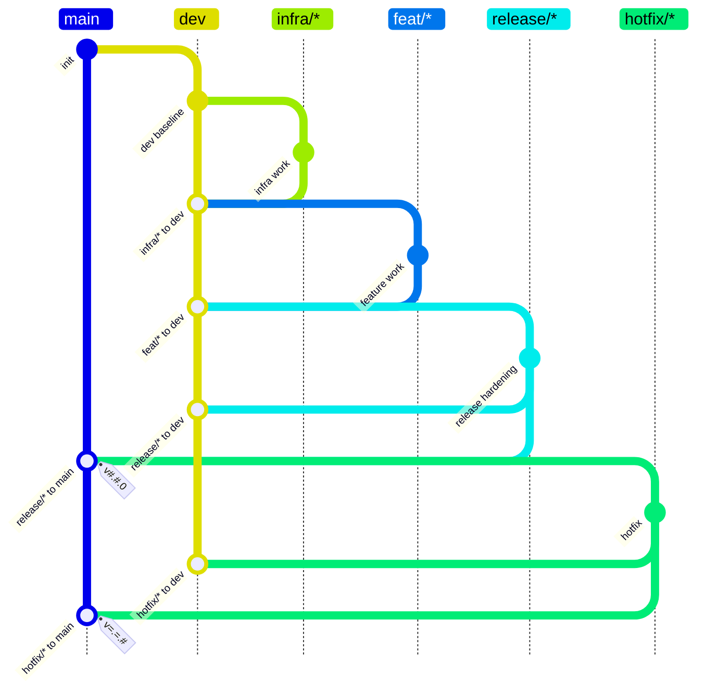

# Git Guard Policy Writer

## Purpose

Write `CONTRIBUTING.md` branch workflow docs where the Mermaid `gitGraph` is a restricted policy DSL, not just an illustration. The graph should be readable by humans and parseable into rules for `reference-transaction` hooks.

## DSL Rules

- Use one Mermaid fenced block with `gitGraph TB:`.
- Treat `main` and `dev` as literal long-lived branches.
- Represent branch families directly as quoted wildcard branches:
  - `"infra/*"`
  - `"feat/*"`
  - `"release/*"`
  - `"hotfix/*"`
- Do not use concrete examples such as `infra/sensor-driver` when the policy means all `infra/*`.
- Always quote wildcard branch names in gitGraph statements: `branch "infra/*"`, `checkout "infra/*"`, `merge "infra/*"`.
- Interpret `branch X` after `checkout Y` as `Y` may branch to `X`.
- Interpret `checkout TARGET` followed by `merge "SOURCE"` as `SOURCE` must be allowed to merge into `TARGET`.
- Write unique Mermaid merge ids because Mermaid treats `id` as a commit id. Prefer readable ids such as `id:"release/* to main"` and use a distinct suffix when the same source and target appear more than once.
- Git Guard derives the machine policy id from the merge source and current checkout target, not from the Mermaid `id` text.
- Do not encode special semantics in labels such as `back-merge`. If a source family must land in multiple targets, express that by merging it into each target in the graph and describe it as a required merge in prose.
- If a source family merges into more than one target, treat those targets as required containment targets for the same source family.
- Put release/hotfix tag symbols directly on the `main` merge statement.
- To express an optional tag, draw the same source-to-target merge twice: once without `tag:"..."` and once with `tag:"..."`. Give the two Mermaid merge commits different `id` values.
- Use tag patterns directly in `tag:"..."` so the graph remains the source of truth:
  - release main merge: `tag:"v#.#.0"`
  - two-component release main merge: `tag:"V#.#"`
  - hotfix main merge: `tag:"v=.=.#"`
- Interpret `#` in tag patterns as one or more decimal digits.
- Interpret `=` in tag patterns as the same numeric component as the base release tag for this source branch.
- Use `v`/`V` exactly as the policy wants tags to be written.

## Naming Rules

- Before writing or revising a config, compare the config directory name, document title, prose, tests, and Mermaid branch families.
- Name configs by the branch families that actually appear in the Mermaid `gitGraph`, not by whether the flow produces a tagged release.
- Use `dev-only` only for `main` plus `dev` with no wildcard branch family.
- Use `dev-feat` for `main`, `dev`, and `feat/*` when there is no `release/*` branch family, even if `dev` merges to `main` with a release tag.
- Use `dev-release` only when the Mermaid graph actually contains a `release/*` branch family.
- Include family names such as `infra`, `feat`, `release`, and `hotfix` in the config name only when those wildcard families exist in the graph.
- Keep the first Markdown heading aligned with the config name, for example `# Dev Feat Flow` for `dev-feat`.
- If a requested name contradicts the branch families, flag the mismatch before implementing or rename the config to match the graph.

## Preferred Graph Shape

Use this shape unless the user gives different branch families:

## Validation Checklist

- Confirm every wildcard branch family is quoted in `gitGraph`.
- Confirm every `merge` has a unique Mermaid `id:"..."`.
- Confirm repeated source-to-target merges are used only for optional tag semantics.
- Confirm `release/*` and `hotfix/*` merge into both `main` and `dev`.
- Confirm release/hotfix tag symbols are attached to their `main` merge statements.
- Confirm tag patterns are explicit numeric patterns: release often uses `v#.#.0` or `V#.#`, hotfix uses `v=.=.#`.
- Confirm there are no example-only branch names if the policy is intended to cover a full family.
- Confirm the accompanying prose and any flowchart do not contradict the `gitGraph`.
- Confirm config names and Markdown titles match the branch families: `dev + feat/*` without `release/*` must be named `dev-feat`, not `dev-release`.
