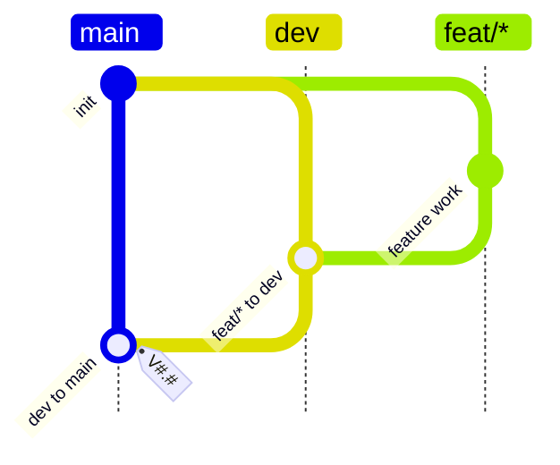

# Dev Feat Flow

## Rules

- `feat/*` branches from `dev`.
- `feat/*` work must merge back to `dev`.
- `dev` is the integration branch and must not receive direct commits after the policy is installed.
- `main` may only receive tagged merges from `dev`.
- `dev` releases must use a `V#.#` tag, where `#` means one or more decimal digits.
- `main` must not receive direct commits.
- Ad hoc tags are not allowed; release tags are allowed only when they satisfy the `dev` to `main` rule.
