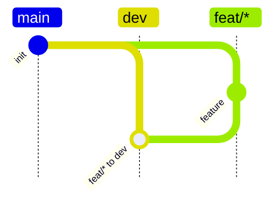

# Git Flow Guard

Git Flow Guard turns a restricted Mermaid `gitGraph` into a local Git `reference-transaction` hook policy.

It is intended for repositories that want branch-flow rules to be written once in a human-readable `contribution.md` file, then enforced locally before invalid branch or tag refs are created.

## Install

Install from this repository:

```bash
python -m pip install -e .
```

This exposes one command:

```bash
git-flow-guard --help
```

When developing directly from this checkout without installing, use:

```bash
PYTHONPATH=src python -m git_flow_guard.cli --help
```

## Concepts

Each policy config lives under `configs/<name>/`:

```text
configs/<name>/
  contribution.md
  policy.yaml
  test_case.py
```

`contribution.md` is the source of truth. It contains one supported Mermaid `gitGraph` block.

`policy.yaml` is generated from `contribution.md` and should not be edited by hand.

`test_case.py` contains config-specific hook behavior tests. Shared test scaffolding lives in `configs/test_base.py`, which only provides generic Git helpers, hook installation, ref snapshots, and rejection assertions. Policy-specific DAG construction and rejection cases belong in each config.

## Supported DSL

Git Flow Guard intentionally supports a small Mermaid subset:

- `branch NAME`: records a branch-from edge from the current checkout.
- `checkout NAME`: changes the current target context.
- `merge NAME id:"SOURCE to TARGET"`: records a merge rule into the current checkout.
- `merge NAME id:"SOURCE to TARGET" tag:"..."`: records a merge rule plus a tag policy.

Wildcard branch families should be quoted:



Tag patterns currently support:

- `#`: one or more decimal digits.
- `=`: same numeric component as the source branch's base release tag.

Examples:

```text
v#.#.0
v=.=.#
```

## Generate Policy

Generate all bundled policies:

```bash
git-flow-guard generate --all
```

Check that generated policies are current:

```bash
git-flow-guard generate --all --check
```

Generate one config:

```bash
git-flow-guard generate configs/infra-feat-release
```

Without installing the package:

```bash
PYTHONPATH=src python -m git_flow_guard.cli generate --all --check
```

## Install Hook

Install one config into a target repository:

```bash
git-flow-guard install \
  --repo /path/to/repo \
  --config infra-feat-release \
  --scope worktree
```

`--config` accepts:

- a bundled config name under `configs/`, for example `infra-feat-release`;
- a config directory containing `contribution.md`;
- a direct path to `contribution.md`.

`--scope` controls where `core.hooksPath` is written:

- `worktree`: writes to this worktree's config. This is the default and is best for multi-worktree development.
- `local`: writes to the repository-local config.
- `global`: writes to the user's global Git config.

The installer writes a repo-relative hook path:

```text
core.hooksPath=.git-flow-guard/hooks
```

It copies the packaged runtime hook into the target repo:

```text
<repo>/.git-flow-guard/hooks/reference-transaction
<repo>/.git-flow-guard/runtime/policy_reference_transaction_hook.py
```

Runtime state is stored in the target repo's Git directory:

```text
<repo>/.git/git-flow-guard-policy.json
<repo>/.git/git-flow-guard-state.json
<repo>/.git/git-flow-guard-hook.log
```

Because the hook path is repo-relative, a repo generated or installed in Docker can still run from the host without referencing container-only paths.

## Test

Run package-level checks without installation:

```bash
PYTHONPATH=src python -m git_flow_guard.cli generate --all --check
PYTHONPATH=src python -m py_compile \
  src/git_flow_guard/__init__.py \
  src/git_flow_guard/cli.py \
  src/git_flow_guard/generate.py \
  src/git_flow_guard/install.py \
  src/git_flow_guard/mermaid.py \
  src/git_flow_guard/runtime/reference_transaction_hook.py \
  test_env/run_policy_hook_tests.py \
  configs/__init__.py \
  configs/test_base.py \
  configs/basic-feature-release/test_case.py \
  configs/infra-feat-release/test_case.py
```

Run integration tests in Docker:

```bash
mkdir -p .tmp
docker compose run --rm policy-hook-tests
docker compose down
```

The integration test runner creates one isolated test repo per config:

```text
.tmp/basic-feature-release
.tmp/infra-feat-release
```

Each test repo contains a valid example Git DAG, then a visible start marker before rejection tests:

```text
=========== GIT FLOW GUARD REJECTION TESTS START ===========
```

If a Git operation that should be rejected is accepted, the test writes a visible failure marker commit:

```text
!!!!!!!! GIT FLOW GUARD EXPECTED REJECTION WAS ACCEPTED !!!!!!!!
```

Successful tests print:

```text
========test finished========
```

This finish marker is stdout only. It is not written into the Git DAG.

## Skill

The bundled Codex skill for writing compatible policy docs lives at:

```text
.codex/skills/git-flow-policy-writer/SKILL.md
```
