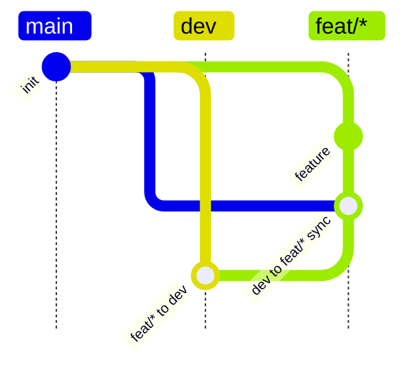

# Git Guard

Git Guard turns a restricted Mermaid `gitGraph` into a local Git `reference-transaction` hook policy.

It is intended for repositories that want branch-flow rules to be written once in a human-readable `contribution.md` file, then enforced locally before invalid branch or tag refs are created.

## Run

The default workflow does not require installing into Python at all:

```bash
PYTHONPATH=src python -m cli --help
```

This only uses the checkout as source code. It does not write to system Python, user site-packages, or global Python package state.

If you want the `git-guard` command on your `PATH`, install it as an isolated uv tool:

```bash
uv tool install --editable .
git-guard --help
```

`uv tool install` creates a uv-managed tool environment. It is not a system Python install. When switching the global `git-guard` command to a different checkout or worktree, reinstall the editable tool from that checkout:

```bash
uv tool install --editable . --force
```

The command path, such as `~/.local/bin/git-guard`, usually stays the same; the important part is which editable checkout the uv tool points at. The project version may not distinguish local worktrees, so confirm a runtime-sync capable install by checking generated hooks:

```bash
rg git_guard_runtime_sync .git-guard/hooks
```

For one-off development checks against the current checkout, prefer `PYTHONPATH=src python -m cli ...` so PATH cannot accidentally use an older uv tool.

Do not run a bare system-level `pip install -e .`. If you choose to use pip manually, activate a project-local virtual environment first:

```bash
python -m venv .venv
. .venv/bin/activate
python -m pip install -e .
```

## Concepts

Each policy config lives under `configs/<name>/`:

```text
configs/<name>/
  contribution.md
  test_case.py
```

`contribution.md` is the source of truth. It contains one supported Mermaid `gitGraph` block.

`policy.json` is generated during installation and copied into the target repository under `.git-guard/`. The hook runtime reads this file directly.

`test_case.py` contains config-specific hook behavior tests. Shared test scaffolding lives in `configs/test_base.py`, which only provides generic Git helpers, hook installation, ref snapshots, and rejection assertions. Policy-specific DAG construction and rejection cases belong in each config.

## Supported DSL

Git Guard intentionally supports a small Mermaid subset:

- `branch NAME`: records a branch-from edge from the current checkout.
- `checkout NAME`: changes the current target context.
- `commit id:"..."`: records direct-commit permission for the current non-`main` checkout.
- `merge NAME id:"unique display label"`: records a merge rule into the current checkout.
- `merge NAME id:"unique display label" tag:"..."`: records a merge rule plus a tag policy for the merge result on the current checkout target.

Mermaid `id` values are commit ids and must be unique within the graph. Git Guard derives the policy rule id from the merge source and current checkout target, for example `dev to main`.

A `commit id` containing bare lowercase `branch` as a whitespace-separated word is treated as a compressed branch-history marker. Mermaid renders it with a dashed outline, and Git Guard ignores it when deriving direct-commit permission. For example, `commit id:"dev branch history"` can make a protected integration branch visible in the diagram without allowing direct commits to that branch.

If the same source and target appear once without `tag:"..."` and once with `tag:"..."`, Git Guard treats the tag as optional: the merge is allowed without a tag, but any matching tag is still validated.

For tag policies, Git Guard follows the Mermaid merge direction: `checkout TARGET` followed by `merge SOURCE tag:"..."` means the tag must point at the merge result on `TARGET`. For example, `checkout main` then `merge dev tag:"V#.#"` expects `V#.#` to point at the relevant `main` commit, not the `dev` head.

For `feat/*` and `infra/*`, an immediately adjacent reverse merge before the normal merge declares `sync_merge_required`. `checkout "feat/*"` followed by `merge dev`, then `checkout dev` and `merge "feat/*"`, means feature branches must finish with a sync merge from the current `dev` before they can merge back into `dev`. If the feature branch commits again after that sync merge, it must sync `dev` again before merging back.

Wildcard branch families should be quoted:



Tag patterns currently support:

- `#`: one or more decimal digits.
- `=`: same numeric component as the source branch's base release tag.
- two-component or three-component tags with a `v` or `V` prefix.

Examples:

```text
V#.#
v#.#.0
v=.=.#
```

## Install Hook

Install one config into a target repository:

```bash
PYTHONPATH=src python -m cli install \
  --repo /path/to/repo \
  --config dev-infra-feat-release-hotfix-case \
  --scope local
```

`--config` accepts:

- a bundled config name under `configs/`, for example `dev-infra-feat-release-hotfix-case`;
- a config directory containing `contribution.md`;
- a direct path to `contribution.md`.

`--scope` controls where `core.hooksPath` is written:

- `local`: writes to the repository-local config. This is the default and is shared by linked worktrees that use the same common Git directory. It also removes this worktree's `core.hooksPath` override so stale worktree config cannot shadow the repository-local hook path.
- `worktree`: writes to this worktree's config only.
- `global`: writes to the user's global Git config.

The installer writes a repo-relative hook path:

```text
core.hooksPath=.git-guard/hooks
```

During installation, the selected `contribution.md` is parsed automatically and copied into the target repository. Users maintain the policy as Markdown, and the installed runtime policy is written next to the hook.

It copies the packaged runtime hook into the target repo:

```text
<repo>/.git-guard/contribution.md
<repo>/.git-guard/config.json
<repo>/.git-guard/enable.sh
<repo>/.git-guard/hooks/pre-commit
<repo>/.git-guard/hooks/pre-push
<repo>/.git-guard/hooks/reference-transaction
<repo>/.git-guard/policy.json
<repo>/.git-guard/runtime/policy_reference_transaction_hook.py
```

Installed hook wrappers can refresh these Git Guard managed files when a hook fires. If `.git-guard/config.json` keeps `runtime.auto_sync` enabled, the wrapper resolves the current machine's `git-guard` command and runs install again with the repo-local policy source:

```bash
git-guard install --repo <repo> --config <repo>/.git-guard/contribution.md --scope <current-scope>
```

This is a local content check, not a network update check. The repo is current when the files that the current local `git-guard install` would generate already match `.git-guard/`; otherwise install rewrites the changed managed files before the runtime hook runs. When runtime auto-sync rewrites anything, the hook prints a visible `git-guard: runtime auto-sync updated installed assets: ...` message naming the updated files. The repo does not store absolute paths to the Git Guard installation, so two machines with the same protected repo use the `git-guard` available on each machine. Existing installations need one manual reinstall before they have wrappers that can auto-sync themselves.

After a protected repository is cloned, users do not need to install this Python package just to enable the checked-in hook. They can run:

```bash
./.git-guard/enable.sh
```

`enable.sh` writes repository-local Git config, so linked worktrees that share the same common Git directory use the same hook path. It also removes this worktree's `core.hooksPath` override so stale worktree config cannot shadow the repository-local hook path. It does not write global Git config:

```text
core.hooksPath=.git-guard/hooks
```

When a Git operation is rejected, the hook prints a `see policy:` hint pointing at `<repo>/.git-guard/contribution.md`. This gives humans and agents a local Markdown file to inspect and repair.

Rejection reasons use a stable `CODE key=value` format, for example:

```text
git-guard: TAG_TARGET_NOT_TARGET_HEAD tag=refs/tags/v1.2.0 target=abc123 target_ref=refs/heads/main
git-guard: see policy: <repo>/.git-guard/contribution.md
git-guard: agent guidance: if you are an agent, read the contribution document and use the configured workflow; do not try to bypass this hook.
```

`.git-guard/config.json` is a human-editable local config file. The installer creates it with defaults and does not overwrite it on later installs:

```json
{
  "branch_logs": {
    "path": ".branch_logs/",
    "force_required": true
  },
  "pre_push": {
    "auto_push_missing_tags": true
  },
  "protected_branches": {
    "enabled": true
  },
  "runtime": {
    "auto_sync": true
  },
  "submodules": {
    "allowed_branches": [
      "main",
      "case/*/*"
    ],
    "main_guard": true
  },
  "worktree": {
    "reject_branch_creation_in_linked_worktree": true
  }
}
```

`branch_logs.path` is a repository-root-relative file or directory path for branch-local development notes. The default `.branch_logs/` keeps only `.branch_logs/.gitkeep` under Git control. Git cannot track an empty directory, so when the default directory path is required, the installer creates `.branch_logs/.gitkeep` as a neutral placeholder.

For the default directory path, the installed `pre-commit` hook normalizes `.branch_logs/` to `.branch_logs/.gitkeep` and discards other files under that directory before the commit is created. For a file-style `branch_logs.path`, Git Guard still requires the file to be tracked and staged cleanly.

If `branch_logs.force_required` is `true`, commits on policy-managed branches must have the configured branch-log placeholder in the index. This is the default. If it is `false`, the path is optional.

`protected_branches.enabled` controls merge-source enforcement for protected branches such as `dev` and `main`. The default `true` requires protected branches to move only through policy-declared sources. Setting it to `false` is an emergency escape hatch for direct fast-forward commits on protected branches; deletes and non-fast-forward updates are still rejected.

`branch_logs.path` is target-local during policy-managed merges. For the default directory path, allowed merge commits must leave `.branch_logs/` as gitkeep-only. Source branch notes such as `.branch_logs/feat.md` are discarded by the commit hook when the merge is committed through the normal guarded flow.

If a Git merge reports conflicts under `branch_logs.path`, resolve any non-branch-log conflicts and run the merge commit; the installed `pre-commit` hook normalizes `.branch_logs/` to gitkeep-only before commit. The runtime hook still verifies the final merge result before the target ref is updated and rejects with `BRANCH_LOG_TARGET_CHANGED` if extra branch-log files bypass the commit hooks.

For required `merge ... tag:"..."` rules, Git Guard treats the branch merge and tag creation as separate Git ref transactions. The merge may complete first, then the hook records a pending tag requirement for the target merge result. Until the matching tag is created, that target ref is locked with `PENDING_TAG_TARGET_MOVED`. Other refs, including the source branch, are not blocked by that pending release tag.

Optional tag rules do not create pending tag requirements. If a matching tag is created later, the hook still validates its name, version order, target branch history, and immutability.

Policy-managed branches cannot be moved to include another managed branch head unless the Mermaid graph declares that merge direction. This is independent of merge strategy: normal allowed merges may be fast-forward or `--no-ff`. For example, if the graph has `dev to main` but no `main to dev`, `git branch -f dev main` is rejected even when the underlying ref move is a fast-forward.

If a `feat/*` or `infra/*` rule has an immediately adjacent reverse sync merge in the Mermaid graph, the protected target merge is rejected with `SYNC_MERGE_REQUIRED` unless the source is already based on the target's current old head or the source head is the merge commit that just merged that target old head into the source. Merge the target branch into the source branch as the final source-branch step before merging back.

Linked worktrees cannot create new local branches while the hook is enabled. A linked worktree is detected when `git rev-parse --git-dir` and `git rev-parse --git-common-dir` resolve to different directories. In that case, `git branch new-name`, `git switch -c new-name`, and other branch-creation ref transactions are rejected with `WORKTREE_BRANCH_CREATION_NOT_ALLOWED`. Create the new branch from the main worktree and give it its own worktree directory instead.

This guard only covers branch creation because it is enforced by the `reference-transaction` hook. Switching a linked worktree to an already-existing branch is not blocked by this hook because that operation does not create a branch ref.

Before any push, the installed `pre-push` hook checks local tags that satisfy the configured release tag rules. If `.git-guard/config.json` keeps `pre_push.auto_push_missing_tags` enabled and a matching local release tag is missing from the target remote, the hook prints a visible `auto-pushing missing release tags` message and pushes that tag first. If the remote already has the same tag name pointing at a different object, the push is rejected with `PUSH_TAG_CONFLICT`.

If `.git-guard/config.json` keeps the boolean `submodules.main_guard` enabled, every local branch ref update checks all submodule gitlinks in the target commit. `submodules.allowed_branches` lists branch names or branch patterns, such as `["main", "case/*/*"]`, that may contain a submodule gitlink commit. The default is `["main", "case/*/*"]`.

A gitlink that equals a matching local `refs/remotes/origin/<branch>` tip is accepted silently. A gitlink behind a matching remote-tracking branch is accepted with a visible warning. A gitlink only reachable from a matching local `refs/heads/<branch>` is accepted with a visible warning because it is on an allowed branch name but is not known to be on `origin`. A gitlink that is not reachable from any configured branch is rejected with `SUBMODULE_COMMIT_NOT_ALLOWED`. Missing submodule worktrees, missing submodule commits, or missing all configured branch refs are rejected because Git Guard cannot verify the submodule state.

This guard does not fetch remotes. Remote decisions use the submodule's locally known remote-tracking refs. Refresh submodule refs before committing when needed:

```bash
git submodule foreach 'git fetch origin "+refs/heads/*:refs/remotes/origin/*"'
```

Runtime state is stored in the target repo's Git directory:

```text
<repo>/.git/git-guard-state.json
<repo>/.git/git-guard-hook.log
```

Because the hook path is repo-relative, a repo generated or installed in Docker can still run from the host without referencing container-only paths.

## Test

Run package-level checks without installation:

```bash
PYTHONPATH=src python -m py_compile \
  src/cli.py \
  src/install.py \
  src/mermaid.py \
  src/runtime/__init__.py \
  src/runtime/reference_transaction_hook.py \
  test_env/run_policy_hook_tests.py \
  configs/__init__.py \
  configs/test_base.py \
  configs/dev-only/test_case.py \
  configs/dev-feat-case/test_case.py \
  configs/dev-feat-release-hotfix-case/test_case.py \
  configs/dev-infra-feat-release-hotfix-case/test_case.py
```

Run integration tests in Docker:

```bash
mkdir -p .tmp
docker compose run --rm policy-hook-tests
docker compose down
```

The integration test runner creates one isolated test repo per config:

```text
.tmp/dev-feat-release-hotfix-case
.tmp/dev-infra-feat-release-hotfix-case
.tmp/dev-only
.tmp/dev-feat-case
```

Each test repo contains a valid example Git DAG, then a visible start marker before rejection tests:

```text
=========== GIT GUARD REJECTION TESTS START ===========
```

If a Git operation that should be rejected is accepted, the test writes a visible failure marker commit:

```text
!!!!!!!! GIT GUARD EXPECTED REJECTION WAS ACCEPTED !!!!!!!!
```

Successful tests print:

```text
========test finished========
```

This finish marker is stdout only. It is not written into the Git DAG.

## Skill

The bundled Codex skill for writing compatible policy docs lives at:

```text
.codex/skills/git-guard-policy-writer/SKILL.md
```

## License

Git Guard is licensed under the GNU Affero General Public License,
version 3 only. The SPDX license identifier is `AGPL-3.0-only`.

See `LICENSE` for the full license text and `NOTICE` for source
attribution. The public source repository is:

```text
https://github.com/ylang-ylang/gitguard
```

The `LICENSE` text is sourced from the Free Software Foundation:

```text
https://www.gnu.org/licenses/agpl-3.0.txt
```
