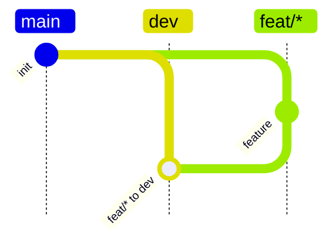

# Git Flow Guard

Git Flow Guard turns a restricted Mermaid `gitGraph` into a local Git `reference-transaction` hook policy.

It is intended for repositories that want branch-flow rules to be written once in a human-readable `contribution.md` file, then enforced locally before invalid branch or tag refs are created.

## Run

The default workflow does not require installing into Python at all:

```bash
PYTHONPATH=src python -m git_flow_guard.cli --help
```

This only uses the checkout as source code. It does not write to system Python, user site-packages, or global Python package state.

If you want the `git-flow-guard` command on your `PATH`, install it as an isolated uv tool:

```bash
uv tool install --editable .
git-flow-guard --help
```

`uv tool install` creates a uv-managed tool environment. It is not a system Python install.

Do not run a bare system-level `pip install -e .`. If you choose to use pip manually, activate a project-local virtual environment first:

```bash
python -m venv .venv
. .venv/bin/activate
python -m pip install -e .
```

## Concepts

Each policy config lives under `configs/<name>/`:

```text
configs/<name>/
  contribution.md
  test_case.py
```

`contribution.md` is the source of truth. It contains one supported Mermaid `gitGraph` block.

`policy.json` is generated during installation and copied into the target repository under `.git-flow-guard/`. The hook runtime reads this file directly.

`test_case.py` contains config-specific hook behavior tests. Shared test scaffolding lives in `configs/test_base.py`, which only provides generic Git helpers, hook installation, ref snapshots, and rejection assertions. Policy-specific DAG construction and rejection cases belong in each config.

## Supported DSL

Git Flow Guard intentionally supports a small Mermaid subset:

- `branch NAME`: records a branch-from edge from the current checkout.
- `checkout NAME`: changes the current target context.
- `merge NAME id:"unique display label"`: records a merge rule into the current checkout.
- `merge NAME id:"unique display label" tag:"..."`: records a merge rule plus a tag policy.

Mermaid `id` values are commit ids and must be unique within the graph. Git Flow Guard derives the policy rule id from the merge source and current checkout target, for example `dev to main`.

If the same source and target appear once without `tag:"..."` and once with `tag:"..."`, Git Flow Guard treats the tag as optional: the merge is allowed without a tag, but any matching tag is still validated.

Wildcard branch families should be quoted:



Tag patterns currently support:

- `#`: one or more decimal digits.
- `=`: same numeric component as the source branch's base release tag.
- two-component or three-component tags with a `v` or `V` prefix.

Examples:

```text
V#.#
v#.#.0
v=.=.#
```

## Install Hook

Install one config into a target repository:

```bash
PYTHONPATH=src python -m git_flow_guard.cli install \
  --repo /path/to/repo \
  --config dev-infra-feat-release-hotfix \
  --scope worktree
```

`--config` accepts:

- a bundled config name under `configs/`, for example `dev-infra-feat-release-hotfix`;
- a config directory containing `contribution.md`;
- a direct path to `contribution.md`.

`--scope` controls where `core.hooksPath` is written:

- `worktree`: writes to this worktree's config. This is the default and is best for multi-worktree development.
- `local`: writes to the repository-local config.
- `global`: writes to the user's global Git config.

The installer writes a repo-relative hook path:

```text
core.hooksPath=.git-flow-guard/hooks
```

During installation, the selected `contribution.md` is parsed automatically and copied into the target repository. Users maintain the policy as Markdown, and the installed runtime policy is written next to the hook.

It copies the packaged runtime hook into the target repo:

```text
<repo>/.git-flow-guard/contribution.md
<repo>/.git-flow-guard/enable.sh
<repo>/.git-flow-guard/hooks/pre-push
<repo>/.git-flow-guard/hooks/reference-transaction
<repo>/.git-flow-guard/policy.json
<repo>/.git-flow-guard/runtime/policy_reference_transaction_hook.py
```

After a protected repository is cloned, users do not need to install this Python package just to enable the checked-in hook. They can run:

```bash
./.git-flow-guard/enable.sh
```

`enable.sh` only writes local Git config for the current worktree:

```text
core.hooksPath=.git-flow-guard/hooks
```

When a Git operation is rejected, the hook prints a `see policy:` hint pointing at `<repo>/.git-flow-guard/contribution.md`. This gives humans and agents a local Markdown file to inspect and repair.

Rejection reasons use a stable `CODE key=value` format, for example:

```text
git-flow-guard: TAG_REQUIRED_TARGETS_MISSING tag=refs/tags/v1.2.0 target=abc123 missing=refs/heads/main
git-flow-guard: see policy: <repo>/.git-flow-guard/contribution.md
git-flow-guard: agent guidance: if you are an agent, read the contribution document and use the configured workflow; do not try to bypass this hook.
```

For required `merge ... tag:"..."` rules, Git Flow Guard treats the branch merge and tag creation as separate Git ref transactions. The merge may complete first, then the hook records a pending tag requirement. Until the matching tag is created, the same tagged merge rule is blocked with `PENDING_TAG_REQUIRED`, and the already-merged source ref is locked with `PENDING_TAG_SOURCE_MOVED`. Other allowed merge rules, such as `dev to main`, are not blocked by that pending release tag.

Optional tag rules do not create pending tag requirements. If a matching tag is created later, the hook still validates its name, version order, target branch containment, and immutability.

Policy-managed branches cannot be moved to include another managed branch head unless the Mermaid graph declares that merge direction. This is independent of merge strategy: normal allowed merges may be fast-forward or `--no-ff`. For example, if the graph has `dev to main` but no `main to dev`, `git branch -f dev main` is rejected even when the underlying ref move is a fast-forward.

Before any push, the installed `pre-push` hook checks local tags that satisfy the configured release tag rules. If a matching local release tag is missing from the target remote, the hook prints a visible `auto-pushing missing release tags` message and pushes that tag first. If the remote already has the same tag name pointing at a different object, the push is rejected with `PUSH_TAG_CONFLICT`.

Runtime state is stored in the target repo's Git directory:

```text
<repo>/.git/git-flow-guard-state.json
<repo>/.git/git-flow-guard-hook.log
```

Because the hook path is repo-relative, a repo generated or installed in Docker can still run from the host without referencing container-only paths.

## Test

Run package-level checks without installation:

```bash
PYTHONPATH=src python -m py_compile \
  src/git_flow_guard/__init__.py \
  src/git_flow_guard/cli.py \
  src/git_flow_guard/install.py \
  src/git_flow_guard/mermaid.py \
  src/git_flow_guard/runtime/reference_transaction_hook.py \
  test_env/run_policy_hook_tests.py \
  configs/__init__.py \
  configs/test_base.py \
  configs/dev-only/test_case.py \
  configs/dev-feat/test_case.py \
  configs/dev-feat-release-hotfix/test_case.py \
  configs/dev-infra-feat-release-hotfix/test_case.py
```

Run integration tests in Docker:

```bash
mkdir -p .tmp
docker compose run --rm policy-hook-tests
docker compose down
```

The integration test runner creates one isolated test repo per config:

```text
.tmp/dev-feat-release-hotfix
.tmp/dev-infra-feat-release-hotfix
.tmp/dev-only
.tmp/dev-feat
```

Each test repo contains a valid example Git DAG, then a visible start marker before rejection tests:

```text
=========== GIT FLOW GUARD REJECTION TESTS START ===========
```

If a Git operation that should be rejected is accepted, the test writes a visible failure marker commit:

```text
!!!!!!!! GIT FLOW GUARD EXPECTED REJECTION WAS ACCEPTED !!!!!!!!
```

Successful tests print:

```text
========test finished========
```

This finish marker is stdout only. It is not written into the Git DAG.

## Skill

The bundled Codex skill for writing compatible policy docs lives at:

```text
.codex/skills/git-flow-policy-writer/SKILL.md
```
