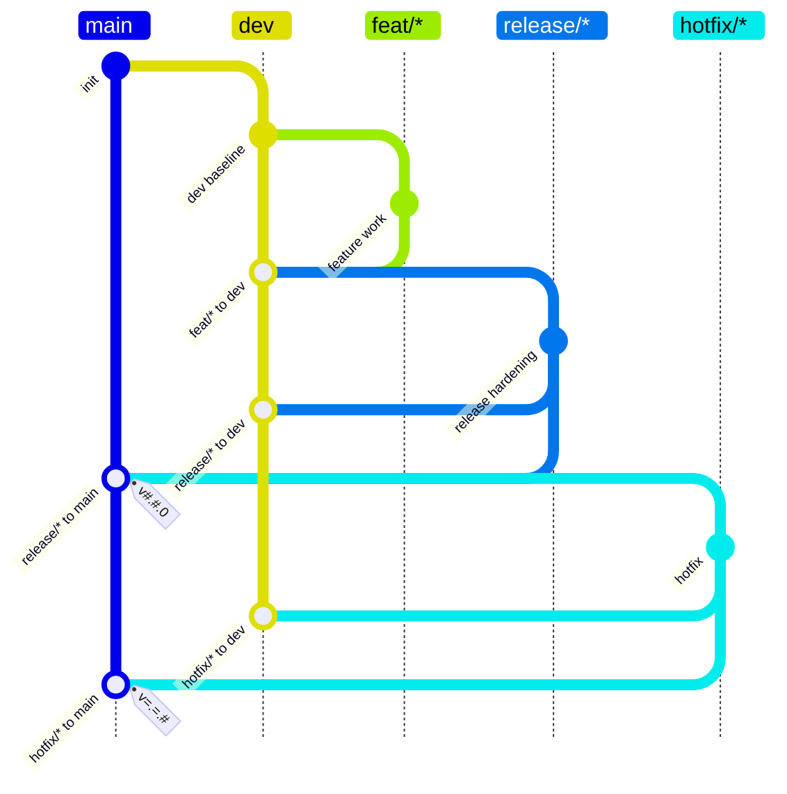

# Basic Feature Release Flow

## Rules

- `feat/*` branches from `dev` and merges to `dev`.
- `release/*` branches from `dev`, must merge to `dev`, then merge to `main` with `v#.#.0`.
- `hotfix/*` branches from `main`, must merge to `dev`, then merge to `main` with `v=.=.#`.
- `#` in tag patterns means one or more decimal digits.
- `=` in tag patterns means the same numeric component as the base release tag for this source branch.
