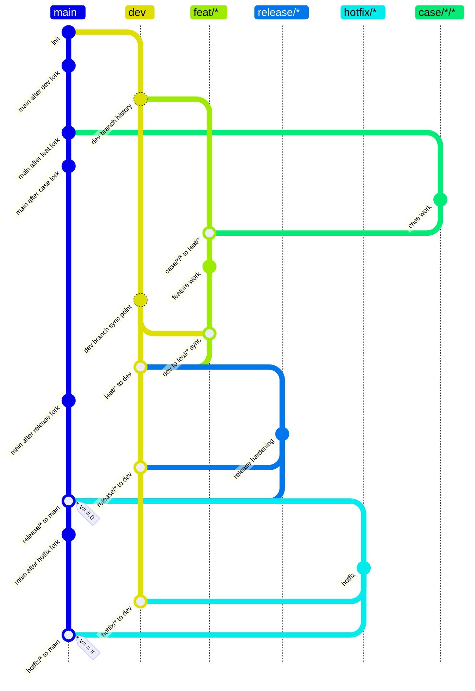

# Basic Feature Release Case Flow

## Rules

- `feat/*` branches from `dev`, must absorb the current `dev`, and merges to `dev`.
- `case/*/*` means `case/<context>/<topic>`, where `<context>` is a real project, customer, dataset, robot, deployment, or reproducible scenario.
- `case/*/*` branches from `main` and may merge only into `feat/*`.
- `case/*/*` must not merge directly into `dev` or `main`; reusable work must be distilled through `feat/*`.
- `release/*` branches from `dev`, must merge to `dev`, then merge to `main`; the `main` merge result must be tagged with `v#.#.0`.
- `hotfix/*` branches from `main`, must merge to `dev`, then merge to `main`; the `main` merge result must be tagged with `v=.=.#`.
- `dev` is the integration branch and must not receive direct commits after the policy is installed.
- `#` in tag patterns means one or more decimal digits.
- `=` in tag patterns means the same numeric component as the base release tag for this source branch.
