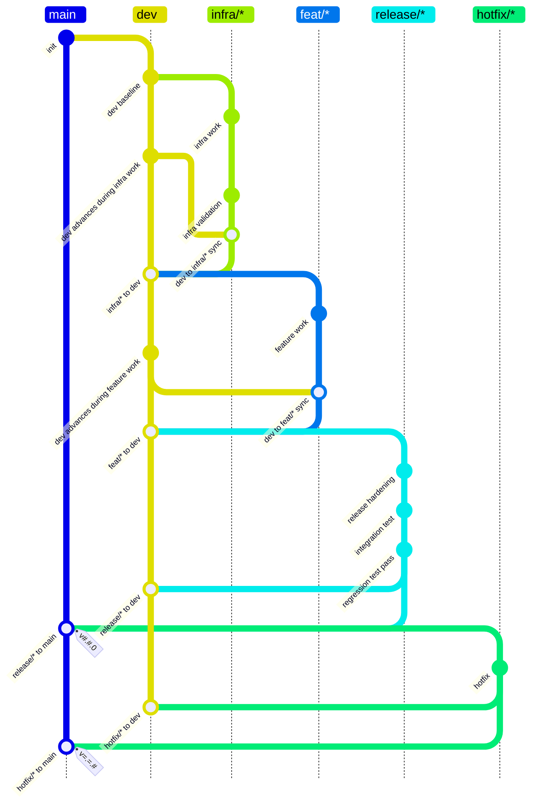

# Infra/Feature Release Flow

## Rules

- `infra/*` and `feat/*` branch from `dev`, must absorb the current `dev`, and merge to `dev`.
- `release/*` branches from `dev`, must merge to `dev`, then merge to `main`; the `main` merge result must be tagged with `v#.#.0`.
- `hotfix/*` branches from `main`, must merge to `dev`, then merge to `main`; the `main` merge result must be tagged with `v=.=.#`.
- `#` in tag patterns means one or more decimal digits.
- `=` in tag patterns means the same numeric component as the base release tag for this source branch.
