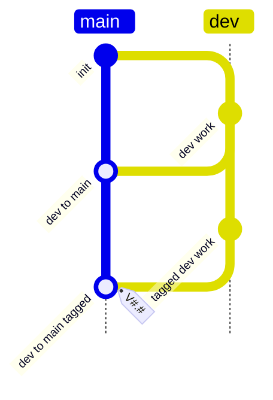

# Dev Only Flow

## Rules

- `dev` is the only development branch and may receive direct commits.
- `main` may only receive merges from `dev`.
- The repeated `dev` to `main` merge declares that `dev` may merge to `main` with or without a `V#.#` tag.
- `V#.#` tags are optional. If created, they must point to a `dev` commit that is already contained by `main`.
- `main` must not receive direct commits.
- Ad hoc tags are not allowed; release tags are allowed only when they satisfy the optional `dev` to `main` tag rule.
