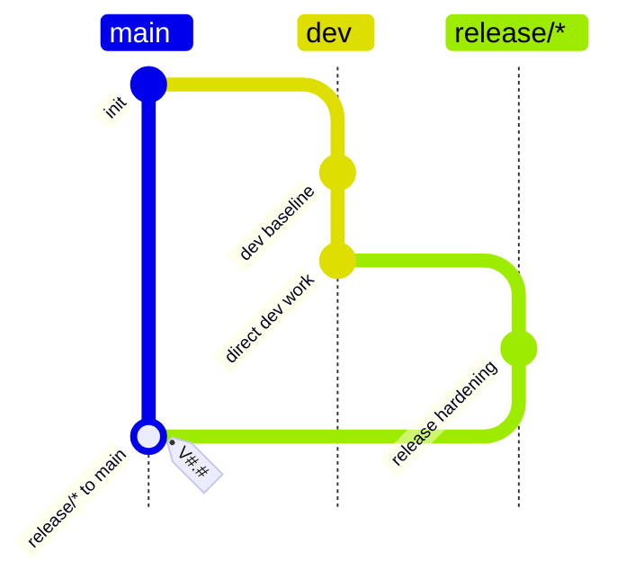

# Dev Only Release Flow

## Rules

- `dev` is the only development branch and may receive direct commits.
- `release/*` branches from `dev`.
- `release/*` is the only branch family allowed to merge into `main`.
- `release/*` releases must use a `V#.#` tag, where `#` means one or more decimal digits.
- `main` must not receive direct commits.
- Ad hoc tags on `main` are not allowed; release tags are allowed only when they satisfy the `release/* to main` rule.
