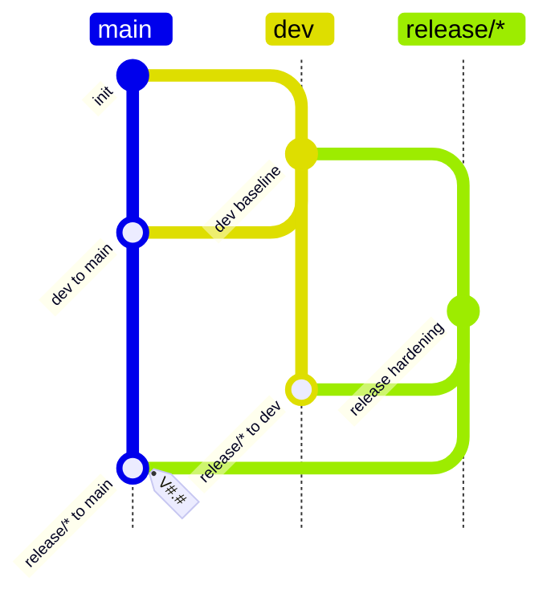

# Dev Release Flow

## Rules

- `dev` may merge directly to `main`.
- `release/*` branches from `dev`.
- `release/*` fixes must merge back to `dev` before they merge to `main` with a `V#.#` tag.
- A missing release tag blocks later `release/* to main` merges, but does not block allowed `dev to main` merges.
